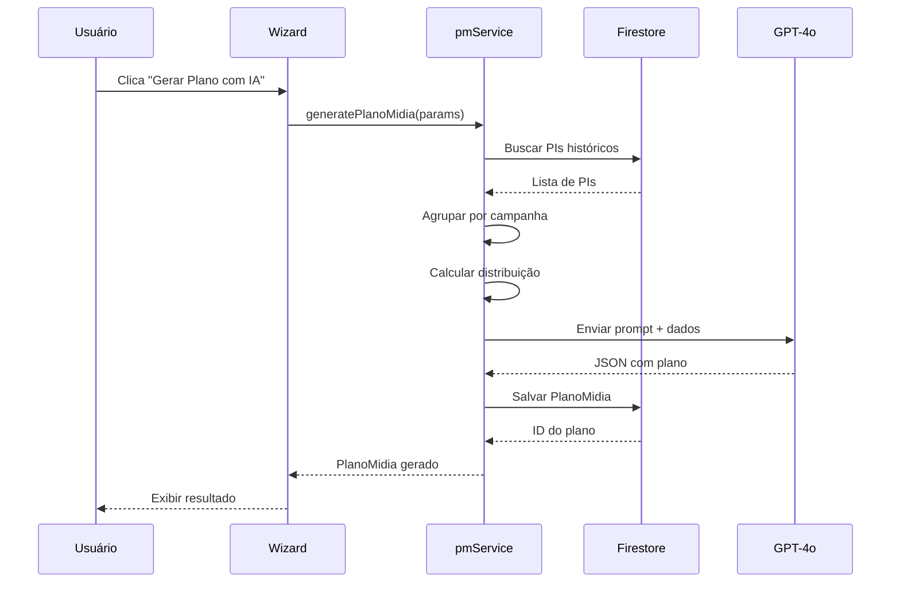
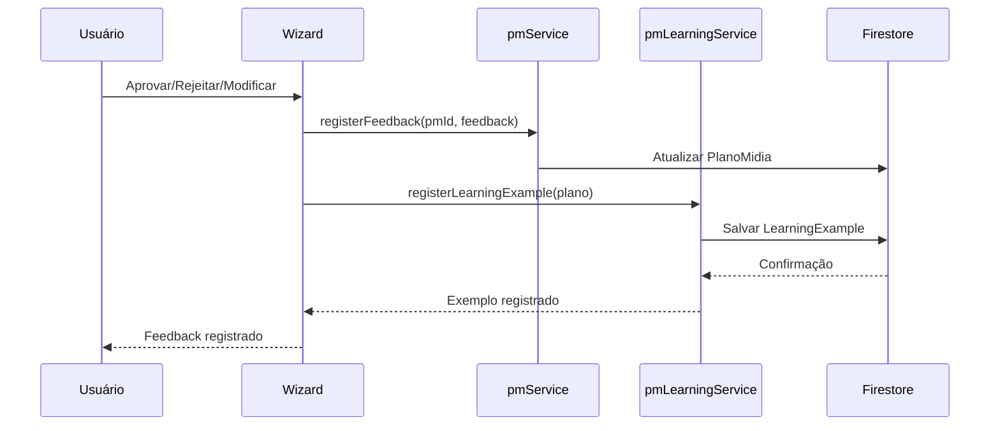
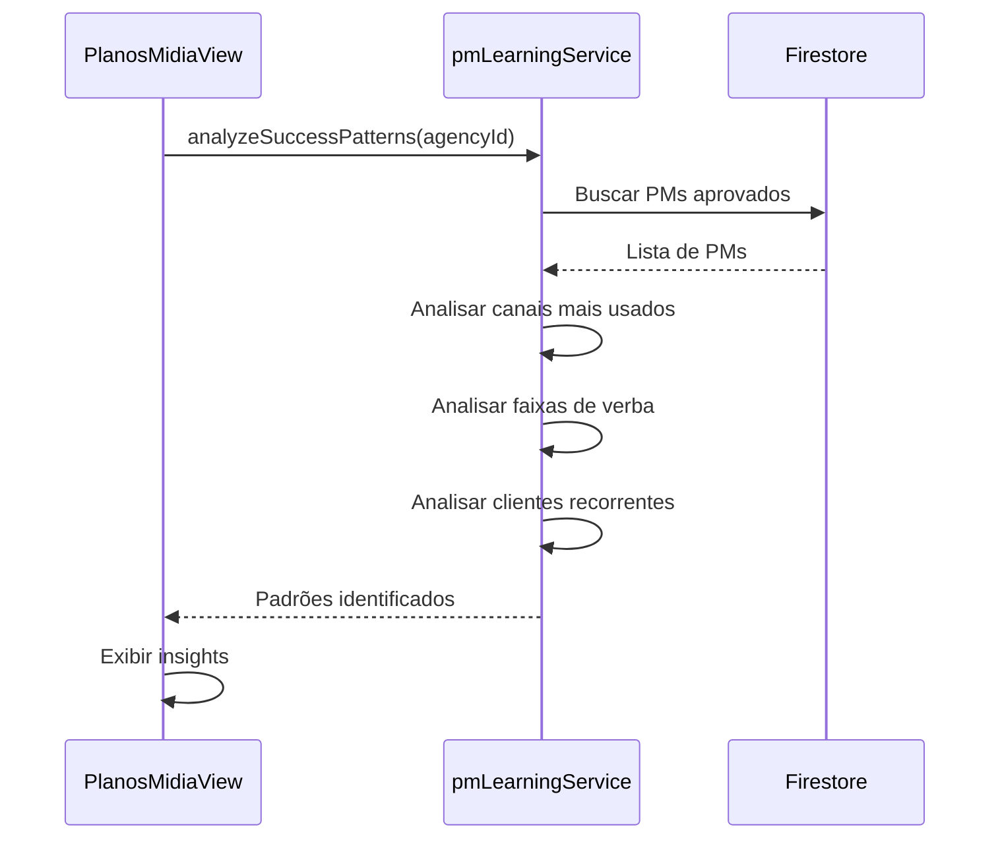

# Sistema de Planos de Mídia com IA - Documentação Completa

## 📋 Índice

1. [Visão Geral](#visão-geral)
2. [Arquitetura](#arquitetura)
3. [Fluxo de Funcionamento](#fluxo-de-funcionamento)
4. [Componentes](#componentes)
5. [Serviços](#serviços)
6. [Tipos de Dados](#tipos-de-dados)
7. [Aprendizado Contínuo](#aprendizado-contínuo)
8. [Guia de Uso](#guia-de-uso)
9. [Métricas e Analytics](#métricas-e-analytics)
10. [Troubleshooting](#troubleshooting)

---

## 🎯 Visão Geral

O **Sistema de Planos de Mídia com IA** é uma funcionalidade avançada do CalixFlow que utiliza **GPT-4o** para gerar automaticamente planos de mídia otimizados baseados em dados históricos de PIs (Pedidos de Inserção).

### Principais Características

- ✅ **Geração Automática**: Cria planos de mídia completos em segundos
- 🧠 **Aprendizado Contínuo**: Melhora a cada plano criado com base em feedback
- 📊 **Análise de Padrões**: Identifica estratégias de sucesso em campanhas anteriores
- 🎯 **Otimização Inteligente**: Distribui verba entre canais de forma otimizada
- 📈 **Métricas Detalhadas**: Acompanha performance e evolução da IA
- 🔄 **Feedback Loop**: Sistema aprende com aprovações, rejeições e modificações

### Benefícios

1. **Economia de Tempo**: Reduz de horas para minutos a criação de um plano de mídia
2. **Decisões Data-Driven**: Baseado em centenas de campanhas anteriores
3. **Consistência**: Mantém padrões de qualidade e estrutura
4. **Melhoria Contínua**: Quanto mais usado, mais preciso se torna
5. **Transparência**: Mostra confiança da IA e justificativa das escolhas

---

## 🏗️ Arquitetura

### Diagrama de Componentes

```
┌─────────────────────────────────────────────────────────────┐
│                    CalixFlow Frontend                        │
├─────────────────────────────────────────────────────────────┤
│                                                               │
│  ┌──────────────────┐        ┌──────────────────┐          │
│  │ PautaPIsViewV2   │        │ PlanosMidiaView  │          │
│  │                  │        │                  │          │
│  │ [Botão Gerar PM] │───────▶│ [Lista de PMs]   │          │
│  └──────────────────┘        └──────────────────┘          │
│           │                           │                      │
│           ▼                           ▼                      │
│  ┌───────────────────────────────────────────────┐          │
│  │      PlanoMidiaGenerator (Wizard)             │          │
│  │                                                │          │
│  │  1. Início → 2. Cliente → 3. Verba →         │          │
│  │  4. Detalhes → 5. Gerando → 6. Resultado     │          │
│  └───────────────────────────────────────────────┘          │
│           │                           │                      │
│           ▼                           ▼                      │
│  ┌──────────────────┐        ┌──────────────────┐          │
│  │   pmService      │        │ pmLearningService│          │
│  │                  │        │                  │          │
│  │ - generatePM()   │◀──────▶│ - registerExample│          │
│  │ - approvePM()    │        │ - getMetrics()   │          │
│  │ - registerFeedback│       │ - analyzePatterns│          │
│  └──────────────────┘        └──────────────────┘          │
│           │                           │                      │
└───────────┼───────────────────────────┼──────────────────────┘
            │                           │
            ▼                           ▼
┌─────────────────────────────────────────────────────────────┐
│                    Firebase Firestore                        │
├─────────────────────────────────────────────────────────────┤
│                                                               │
│  Collections:                                                 │
│  - planos_midia (PlanoMidia)                                 │
│  - pm_learning_examples (LearningExample)                    │
│  - pis (PI) - dados históricos                               │
│                                                               │
└─────────────────────────────────────────────────────────────┘
            │
            ▼
┌─────────────────────────────────────────────────────────────┐
│                      OpenAI GPT-4o                           │
├─────────────────────────────────────────────────────────────┤
│                                                               │
│  - Analisa dados históricos de PIs                           │
│  - Identifica padrões de distribuição                        │
│  - Gera plano otimizado                                      │
│  - Retorna JSON estruturado                                  │
│                                                               │
└─────────────────────────────────────────────────────────────┘
```

### Stack Tecnológico

- **Frontend**: React + TypeScript + Vite
- **UI**: Tailwind CSS + shadcn/ui
- **Backend**: Firebase Firestore
- **IA**: OpenAI GPT-4o
- **Deploy**: Vercel

---

## 🔄 Fluxo de Funcionamento

### 1. Geração de Plano de Mídia



### 2. Feedback e Aprendizado



### 3. Análise de Padrões



---

## 🧩 Componentes

### PlanoMidiaGenerator.tsx

**Wizard de 6 etapas** para geração de planos de mídia.

#### Etapas

1. **Início**: Apresentação e benefícios
2. **Cliente**: Seleção de cliente e nome da campanha
3. **Verba**: Definição de verba total e período
4. **Detalhes**: Objetivos e público-alvo (opcional)
5. **Gerando**: Loading com análise de dados
6. **Resultado**: Visualização e ações (aprovar/rejeitar/modificar)

#### Props

```typescript
interface PlanoMidiaGeneratorProps {
  clients: Client[];
  onClose: () => void;
  onPlanoGerado: (plano: PlanoMidia) => void;
}
```

#### Exemplo de Uso

```tsx
<PlanoMidiaGenerator
  clients={clients}
  onClose={() => setShowPMGenerator(false)}
  onPlanoGerado={(plano) => {
    console.log('Plano gerado:', plano);
    loadData();
  }}
/>
```

### PlanosMidiaView.tsx

**View principal** para listagem e gerenciamento de planos de mídia.

#### Funcionalidades

- ✅ Lista todos os planos de mídia da agência
- 📊 Cards de estatísticas (Total, Aprovados, Modificados, Rejeitados, Confiança Média)
- 📈 Métricas de aprendizado (Taxa de Acerto, Total de Exemplos)
- 💡 Sugestões de melhoria automáticas
- 🔍 Filtro por cliente
- 👁️ Visualização detalhada
- 📥 Exportação (PDF - em desenvolvimento)
- 🗑️ Exclusão de planos

#### Exemplo de Card de Estatística

```tsx
<div className="bg-white rounded-xl p-4 shadow-sm border border-gray-200">
  <div className="flex items-center justify-between mb-2">
    <span className="text-gray-600 text-sm">Total de PMs</span>
    <FileText className="h-5 w-5 text-purple-600" />
  </div>
  <div className="text-3xl font-bold text-gray-900">{stats.totalPMs}</div>
</div>
```

---

## ⚙️ Serviços

### pmService.ts

Serviço principal para geração e gestão de planos de mídia.

#### Funções Principais

##### `collectTrainingData(agencyId, clientId?)`

Coleta dados históricos de PIs para treinar a IA.

```typescript
const trainingData = await collectTrainingData('agency123', 'client456');
// Retorna: PMTrainingData[]
```

**Processo:**
1. Busca todos os PIs da agência/cliente
2. Agrupa por cliente + campanha
3. Calcula distribuição por canal
4. Converte valores para porcentagens
5. Infere setor do cliente

##### `generatePlanoMidia(params, userId)`

Gera um plano de mídia usando GPT-4o.

```typescript
const params: GeneratePMParams = {
  agencyId: 'agency123',
  clientId: 'client456',
  cliente: 'Banco da Amazônia',
  campanha: 'Lançamento Produto X',
  periodo: {
    inicio: '2025-01-01',
    fim: '2025-03-31'
  },
  verba: 500000,
  objetivos: 'Aumentar awareness',
  publicoAlvo: 'Classe A/B, 25-45 anos'
};

const plano = await generatePlanoMidia(params, 'user123');
```

**Processo:**
1. Coleta dados históricos
2. Constrói prompt com contexto
3. Chama OpenAI GPT-4o
4. Parseia resposta JSON
5. Calcula valores por canal
6. Salva no Firestore
7. Retorna PlanoMidia

##### `registerFeedback(pmId, feedback, userId)`

Registra feedback do usuário sobre o PM gerado.

```typescript
await registerFeedback('pm123', 'aprovado', 'user123');
```

**Feedbacks possíveis:**
- `aprovado`: PM aceito sem modificações
- `rejeitado`: PM descartado, gerar novo
- `modificado`: PM editado manualmente antes de usar

##### `approvePlanoMidia(pmId, userId)`

Aprova um plano e registra para aprendizado.

```typescript
await approvePlanoMidia('pm123', 'user123');
```

**Processo:**
1. Atualiza status para 'aprovado'
2. Registra feedback 'aprovado'
3. Salva exemplo para aprendizado

##### `getPerformanceStats(agencyId)`

Retorna estatísticas de performance dos PMs.

```typescript
const stats = await getPerformanceStats('agency123');
// {
//   totalPMs: 50,
//   aprovados: 35,
//   rejeitados: 5,
//   modificados: 10,
//   confianciaMedia: 87.5
// }
```

### pmLearningService.ts

Serviço de aprendizado contínuo e análise de padrões.

#### Funções Principais

##### `registerLearningExample(pm)`

Registra um exemplo de aprendizado baseado em um PM.

```typescript
await registerLearningExample(planoMidia);
```

**Só registra se:**
- PM tiver feedback do usuário
- Feedback for 'aprovado', 'rejeitado' ou 'modificado'

##### `getLearningMetrics(agencyId)`

Calcula métricas de aprendizado.

```typescript
const metrics = await getLearningMetrics('agency123');
// {
//   totalExamples: 100,
//   aprovados: 70,
//   rejeitados: 10,
//   modificados: 20,
//   taxaAcerto: 80, // (aprovados + modificados*0.5) / total
//   confianciaMedia: 85,
//   evolucao: [
//     { mes: '2025-01', taxaAcerto: 75 },
//     { mes: '2025-02', taxaAcerto: 80 },
//     { mes: '2025-03', taxaAcerto: 85 }
//   ]
// }
```

##### `analyzeSuccessPatterns(agencyId)`

Analisa padrões de sucesso nos PMs aprovados.

```typescript
const patterns = await analyzeSuccessPatterns('agency123');
// {
//   canaisMaisUsados: [
//     { canal: 'TV', frequencia: 45 },
//     { canal: 'Internet', frequencia: 30 },
//     { canal: 'Radio', frequencia: 15 }
//   ],
//   faixasVerbaComuns: [
//     { min: 100000, max: 500000, frequencia: 25 },
//     { min: 500000, max: 1000000, frequencia: 15 }
//   ],
//   clientesRecorrentes: [
//     { cliente: 'Banco da Amazônia', totalPMs: 12 },
//     { cliente: 'Empresa X', totalPMs: 8 }
//   ]
// }
```

##### `suggestImprovements(agencyId)`

Sugere melhorias baseadas em padrões identificados.

```typescript
const suggestions = await suggestImprovements('agency123');
// [
//   'O canal TV é o mais usado em PMs aprovados (45 vezes). Considere priorizá-lo.',
//   'A taxa de acerto está melhorando! Continue fornecendo feedback.'
// ]
```

##### `exportForFineTuning(agencyId)`

Exporta exemplos no formato JSONL para fine-tuning do OpenAI.

```typescript
const jsonl = await exportForFineTuning('agency123');
// Retorna string JSONL pronta para upload
```

**Formato:**
```jsonl
{"messages":[{"role":"system","content":"Você é um especialista..."},{"role":"user","content":"Cliente: Banco..."},{"role":"assistant","content":"Distribuição: TV: 50%..."}]}
{"messages":[...]}
```

---

## 📊 Tipos de Dados

### PlanoMidia

```typescript
interface PlanoMidia {
  id: string;
  agencyId: string;
  clientId: string;
  cliente: string;
  campanha: string;
  periodo: {
    inicio: string; // YYYY-MM-DD
    fim: string;    // YYYY-MM-DD
  };
  verba: number;
  distribuicao: DistribuicaoCanal[];
  status: 'rascunho' | 'aprovado' | 'em_execucao' | 'concluido' | 'cancelado';
  createdBy: string;
  createdAt: Timestamp;
  updatedAt: Timestamp;
  geradoPorIA: boolean;
  confiancaIA?: number; // 0-100
  feedbackUsuario?: 'aprovado' | 'rejeitado' | 'modificado';
}
```

### DistribuicaoCanal

```typescript
interface DistribuicaoCanal {
  canal: 'TV' | 'Internet' | 'Radio' | 'OOH' | 'Jornal' | 'Revista';
  porcentagem: number;
  valor: number;
  veiculos: VeiculoPlano[];
}
```

### VeiculoPlano

```typescript
interface VeiculoPlano {
  nome: string;
  formato: string;
  quantidade: number;
  valorUnitario: number;
  valorTotal: number;
  periodo: {
    inicio: string;
    fim: string;
  };
}
```

### PMTrainingData

```typescript
interface PMTrainingData {
  id: string;
  agencyId: string;
  clientId: string;
  cliente: string;
  setor: string;
  verba: number;
  distribuicao: Record<string, number>; // canal -> porcentagem
  performance?: {
    alcance?: number;
    conversao?: number;
    roi?: number;
  };
  createdAt: Timestamp;
}
```

### LearningExample

```typescript
interface LearningExample {
  id: string;
  agencyId: string;
  prompt: string;
  completion: string;
  feedback: 'aprovado' | 'rejeitado' | 'modificado';
  confianciaIA: number;
  createdAt: Timestamp;
}
```

---

## 🧠 Aprendizado Contínuo

### Como Funciona

O sistema implementa um **feedback loop** que melhora a IA a cada plano criado:

```
┌─────────────────────────────────────────────────────────┐
│                  Ciclo de Aprendizado                    │
└─────────────────────────────────────────────────────────┘

1. GERAÇÃO
   ↓
   GPT-4o analisa dados históricos
   ↓
   Gera plano de mídia
   ↓
   Atribui confiança (0-100%)

2. FEEDBACK
   ↓
   Usuário aprova/rejeita/modifica
   ↓
   Sistema registra feedback
   ↓
   Salva exemplo de aprendizado

3. ANÁLISE
   ↓
   Identifica padrões de sucesso
   ↓
   Calcula métricas de performance
   ↓
   Gera sugestões de melhoria

4. MELHORIA
   ↓
   Próximas gerações consideram:
   - Padrões identificados
   - Feedback anterior
   - Taxa de acerto
   ↓
   Volta para (1) com IA mais precisa
```

### Métricas de Qualidade

#### Taxa de Acerto

```
Taxa de Acerto = (Aprovados + Modificados × 0.5) / Total × 100
```

**Interpretação:**
- **> 80%**: Excelente - IA muito precisa
- **60-80%**: Bom - IA aprendendo
- **< 60%**: Precisa melhorar - revisar dados

#### Confiança da IA

A IA atribui uma **confiança** (0-100%) para cada plano gerado baseada em:

- Quantidade de dados históricos disponíveis
- Similaridade com campanhas anteriores
- Consistência dos padrões identificados

**Exemplo:**
```typescript
{
  confiancaIA: 85,
  justificativa: "Baseado em 15 campanhas similares do setor financeiro"
}
```

### Evolução ao Longo do Tempo

O sistema rastreia a evolução mês a mês:

```typescript
evolucao: [
  { mes: '2025-01', taxaAcerto: 65 },
  { mes: '2025-02', taxaAcerto: 72 },
  { mes: '2025-03', taxaAcerto: 78 },
  { mes: '2025-04', taxaAcerto: 85 }
]
```

**Gráfico de Evolução:**
```
Taxa de Acerto (%)
100 ┤
 90 ┤                                    ●
 80 ┤                            ●
 70 ┤                    ●
 60 ┤            ●
 50 ┤
    └────────────────────────────────────
     Jan    Fev    Mar    Abr    Mai
```

---

## 📖 Guia de Uso

### Para Usuários

#### 1. Gerar Novo Plano de Mídia

**Passo a Passo:**

1. Acesse **"Pauta de PIs"** ou **"Planos de Mídia IA"**
2. Clique no botão **"Gerar Plano de Mídia com IA"**
3. **Etapa 1 - Início**: Leia os benefícios e clique "Começar"
4. **Etapa 2 - Cliente**:
   - Selecione o cliente
   - Digite o nome da campanha
   - Clique "Continuar"
5. **Etapa 3 - Verba**:
   - Informe a verba total (ex: R$ 500.000)
   - Selecione data de início
   - Selecione data de fim
   - Clique "Continuar"
6. **Etapa 4 - Detalhes** (opcional):
   - Descreva os objetivos da campanha
   - Descreva o público-alvo
   - Clique "Gerar Plano com IA"
7. **Etapa 5 - Gerando**: Aguarde a análise (15-30 segundos)
8. **Etapa 6 - Resultado**:
   - Revise o plano gerado
   - Veja a distribuição por canal
   - Veja os veículos sugeridos
   - Escolha uma ação:
     - ✅ **Aprovar Plano**: Salva e registra como sucesso
     - ✏️ **Editar Manualmente**: Salva para edição posterior
     - ❌ **Rejeitar e Gerar Novo**: Descarta e gera outro

#### 2. Visualizar Planos Existentes

1. Acesse **"Planos de Mídia IA"**
2. Veja os cards de estatísticas no topo
3. Use os filtros de cliente para refinar
4. Clique em ações:
   - 👁️ **Visualizar**: Ver detalhes completos
   - 📥 **Exportar**: Baixar PDF (em desenvolvimento)
   - 🗑️ **Excluir**: Remover plano

#### 3. Acompanhar Métricas

Na view **"Planos de Mídia IA"**, veja:

- **Total de PMs**: Quantidade total gerada
- **Aprovados**: PMs aceitos sem modificação
- **Modificados**: PMs editados manualmente
- **Rejeitados**: PMs descartados
- **Confiança Média**: Precisão da IA

**Métricas de Aprendizado:**
- Taxa de Acerto
- Total de Exemplos
- Confiança Média

**Sugestões de Melhoria:**
- Insights automáticos baseados em padrões

### Para Desenvolvedores

#### Integrar em Nova View

```tsx
import PlanoMidiaGenerator from '../components/PlanoMidiaGenerator';
import { ClientService } from '../services/clientService';

function MyView() {
  const [clients, setClients] = useState<Client[]>([]);
  const [showGenerator, setShowGenerator] = useState(false);

  useEffect(() => {
    loadClients();
  }, []);

  const loadClients = async () => {
    const data = await ClientService.listClients(agencyId);
    setClients(data);
  };

  return (
    <div>
      <button onClick={() => setShowGenerator(true)}>
        Gerar PM
      </button>

      {showGenerator && (
        <PlanoMidiaGenerator
          clients={clients}
          onClose={() => setShowGenerator(false)}
          onPlanoGerado={(plano) => {
            console.log('PM gerado:', plano);
            // Fazer algo com o plano
          }}
        />
      )}
    </div>
  );
}
```

#### Customizar Prompt da IA

Edite `pmService.ts` → `buildPrompt()`:

```typescript
function buildPrompt(params: GeneratePMParams, trainingData: PMTrainingData[]): string {
  return `
Gere um plano de mídia otimizado com base nos seguintes dados:

**CAMPANHA ATUAL:**
- Cliente: ${params.cliente}
- Campanha: ${params.campanha}
...

**INSTRUÇÕES CUSTOMIZADAS:**
1. Priorize canais digitais para público jovem
2. Considere sazonalidade do setor
3. ...
`;
}
```

#### Adicionar Novo Canal

1. Atualizar tipo `DistribuicaoCanal`:

```typescript
// src/types/firestore.ts
interface DistribuicaoCanal {
  canal: 'TV' | 'Internet' | 'Radio' | 'OOH' | 'Jornal' | 'Revista' | 'Podcast'; // Adicionar 'Podcast'
  ...
}
```

2. Atualizar mapeamento em `pmService.ts`:

```typescript
function mapMeioToCanal(meio: string): string {
  const mapping: Record<string, string> = {
    'TV': 'TV',
    'Rádio': 'Radio',
    'Digital': 'Internet',
    'Impresso': 'Jornal',
    'OOH': 'OOH',
    'Cinema': 'OOH',
    'Podcast': 'Podcast' // Adicionar
  };
  return mapping[meio] || 'Internet';
}
```

3. Adicionar ícone em `PlanoMidiaGenerator.tsx`:

```typescript
const getIconeCanal = (canal: string) => {
  switch (canal) {
    case 'TV': return <Tv className="h-5 w-5" />;
    case 'Internet': return <Globe className="h-5 w-5" />;
    case 'Radio': return <Radio className="h-5 w-5" />;
    case 'OOH': return <Eye className="h-5 w-5" />;
    case 'Podcast': return <Mic className="h-5 w-5" />; // Adicionar
    default: return <FileText className="h-5 w-5" />;
  }
};
```

---

## 📈 Métricas e Analytics

### Dashboard de Métricas

A view **PlanosMidiaView** exibe métricas em tempo real:

#### Cards de Estatísticas

```tsx
┌─────────────────┐ ┌─────────────────┐ ┌─────────────────┐
│ Total de PMs    │ │ Aprovados       │ │ Modificados     │
│      50         │ │      35         │ │      10         │
└─────────────────┘ └─────────────────┘ └─────────────────┘

┌─────────────────┐ ┌─────────────────┐
│ Rejeitados      │ │ Confiança Média │
│       5         │ │     87.5%       │
└─────────────────┘ └─────────────────┘
```

#### Métricas de Aprendizado

```tsx
┌──────────────────────────────────────────────────────────┐
│              Métricas de Aprendizado                     │
├──────────────────────────────────────────────────────────┤
│                                                          │
│  Taxa de Acerto: 80.0%                                  │
│  Total de Exemplos: 100                                 │
│  Confiança Média: 85%                                   │
│                                                          │
└──────────────────────────────────────────────────────────┘
```

#### Sugestões de Melhoria

```tsx
┌──────────────────────────────────────────────────────────┐
│              Sugestões de Melhoria                       │
├──────────────────────────────────────────────────────────┤
│                                                          │
│  • O canal TV é o mais usado em PMs aprovados (45       │
│    vezes). Considere priorizá-lo em novas campanhas.   │
│                                                          │
│  • A taxa de acerto está melhorando! Continue           │
│    fornecendo feedback nos PMs gerados.                 │
│                                                          │
└──────────────────────────────────────────────────────────┘
```

### Análise de Padrões

#### Canais Mais Usados

```typescript
canaisMaisUsados: [
  { canal: 'TV', frequencia: 45 },
  { canal: 'Internet', frequencia: 30 },
  { canal: 'Radio', frequencia: 15 },
  { canal: 'OOH', frequencia: 10 }
]
```

**Visualização:**
```
TV        ████████████████████████████████████████████ 45
Internet  ██████████████████████████████ 30
Radio     ███████████████ 15
OOH       ██████████ 10
```

#### Faixas de Verba Comuns

```typescript
faixasVerbaComuns: [
  { min: 0, max: 50000, frequencia: 5 },
  { min: 50000, max: 100000, frequencia: 10 },
  { min: 100000, max: 500000, frequencia: 25 },
  { min: 500000, max: 1000000, frequencia: 15 },
  { min: 1000000, max: Infinity, frequencia: 5 }
]
```

**Visualização:**
```
R$ 0 - 50k          █████ 5
R$ 50k - 100k       ██████████ 10
R$ 100k - 500k      █████████████████████████ 25
R$ 500k - 1M        ███████████████ 15
R$ 1M+              █████ 5
```

---

## 🔧 Troubleshooting

### Problemas Comuns

#### 1. "Erro ao gerar plano de mídia"

**Possíveis causas:**
- API Key do OpenAI inválida ou expirada
- Sem dados históricos suficientes
- Erro de rede

**Solução:**
1. Verificar `.env`:
   ```
   VITE_OPENAI_API_KEY=sk-...
   ```
2. Verificar se há PIs cadastrados:
   ```typescript
   const pis = await PIService.listPIs({ agencyId });
   console.log('Total de PIs:', pis.length);
   ```
3. Verificar console do navegador para erros detalhados

#### 2. "Confiança da IA muito baixa (< 50%)"

**Possíveis causas:**
- Poucos dados históricos
- Dados muito heterogêneos
- Cliente/setor novo sem histórico

**Solução:**
1. Cadastrar mais PIs históricos
2. Fornecer mais detalhes (objetivos, público-alvo)
3. Aprovar PMs gerados para criar base de aprendizado

#### 3. "Taxa de acerto não está melhorando"

**Possíveis causas:**
- Falta de feedback consistente
- Dados históricos de baixa qualidade
- Campanhas muito diferentes entre si

**Solução:**
1. Sempre fornecer feedback (aprovar/rejeitar/modificar)
2. Revisar qualidade dos PIs cadastrados
3. Segmentar por tipo de campanha/cliente

#### 4. "Plano gerado não faz sentido"

**Possíveis causas:**
- Prompt mal construído
- Dados históricos inconsistentes
- Parâmetros incorretos

**Solução:**
1. Rejeitar e gerar novo
2. Fornecer mais contexto (objetivos, público)
3. Revisar dados históricos de PIs

### Logs e Debug

#### Habilitar Logs Detalhados

```typescript
// src/services/pmService.ts
const DEBUG = true;

export async function generatePlanoMidia(params: GeneratePMParams, userId: string) {
  if (DEBUG) {
    console.log('[PM] Iniciando geração:', params);
  }
  
  const trainingData = await collectTrainingData(params.agencyId, params.clientId);
  
  if (DEBUG) {
    console.log('[PM] Dados de treinamento:', trainingData.length, 'campanhas');
  }
  
  // ...
}
```

#### Verificar Resposta da IA

```typescript
const completion = await openai.chat.completions.create({...});
const response = completion.choices[0].message.content;

console.log('[PM] Resposta da IA:', response);

const aiResult = JSON.parse(response);
console.log('[PM] Resultado parseado:', aiResult);
```

#### Monitorar Firestore

```typescript
// Verificar se planos estão sendo salvos
const planos = await getDocs(collection(db, 'planos_midia'));
console.log('Total de planos:', planos.size);

// Verificar exemplos de aprendizado
const examples = await getDocs(collection(db, 'pm_learning_examples'));
console.log('Total de exemplos:', examples.size);
```

---

## 🚀 Próximos Passos

### Melhorias Planejadas

1. **Exportação de PDF**
   - Gerar PDF profissional do plano de mídia
   - Incluir gráficos de distribuição
   - Logo da agência e cliente

2. **Edição Manual**
   - Interface para editar plano gerado
   - Ajustar porcentagens e valores
   - Adicionar/remover veículos

3. **Fine-Tuning Automático**
   - Treinar modelo customizado com dados da agência
   - Melhorar precisão específica para cada cliente
   - Atualização mensal automática

4. **Integração com ERP**
   - Importar dados de campanhas executadas
   - Incluir métricas de performance real
   - Feedback automático baseado em ROI

5. **Análise Preditiva**
   - Prever performance de um plano
   - Sugerir ajustes para maximizar ROI
   - Alertas de risco

6. **Comparação de Planos**
   - Comparar 2+ planos lado a lado
   - Análise de diferenças
   - Recomendação do melhor

7. **Templates Personalizados**
   - Salvar planos como templates
   - Reutilizar estrutura em novas campanhas
   - Biblioteca de templates por setor

---

## 📝 Changelog

### v1.0.0 - 2025-01-24

**Lançamento Inicial**

- ✅ Geração automática de planos de mídia com GPT-4o
- ✅ Wizard de 6 etapas
- ✅ Sistema de feedback (aprovar/rejeitar/modificar)
- ✅ Aprendizado contínuo
- ✅ Análise de padrões de sucesso
- ✅ Métricas de performance
- ✅ Sugestões de melhoria automáticas
- ✅ Integração com Pauta de PIs
- ✅ View dedicada de Planos de Mídia
- ✅ Filtros por cliente
- ✅ Estatísticas em tempo real

---

## 👥 Suporte

Para dúvidas ou problemas:

1. Consulte esta documentação
2. Verifique a seção [Troubleshooting](#troubleshooting)
3. Entre em contato com a equipe de desenvolvimento

---

## 📄 Licença

Propriedade da Calix. Todos os direitos reservados.

---

**Última atualização:** 24 de Janeiro de 2025  
**Versão:** 1.0.0  
**Autor:** Equipe CalixFlow
